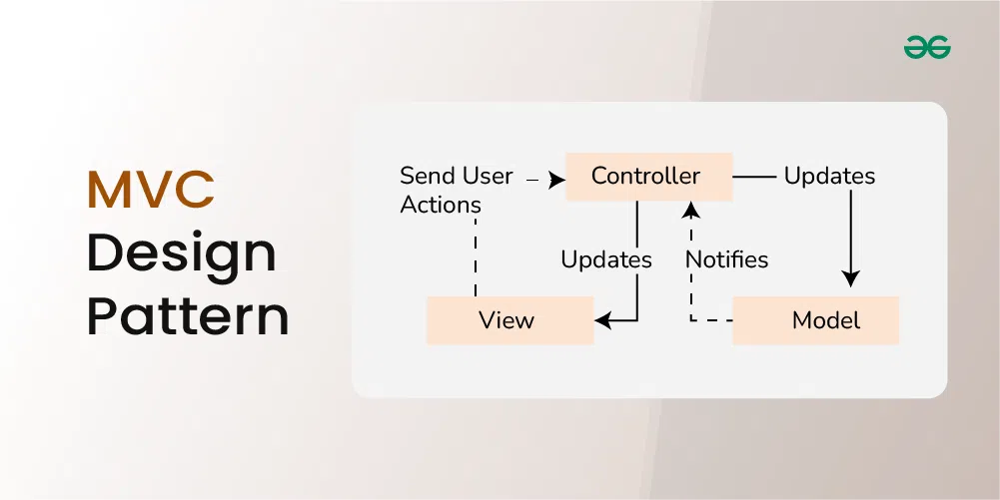

#  MoviePix

## Description

Search for your favorite movies, shows, and watch movie trailers, and read reviews. See whats popular now, whats upcoming and more...

## Homepage

Click [here](https://moviepix.netlify.app/) to check it out!

## Built With

### Architecture

## Contact

If you have any additional questions, feel free to reach out to me.

- [LinkedIn](https://www.linkedin.com/in/brandon-knight-21940a206/)
- [Github](https://github.com/blksmk8483)
- [Email](brandonknightwork@gmail.com)
